# 吴帅卿 · 作品集

**嵌入式硬件工程师 / 机电一体化** · 机器人硬件系统 · 嵌入式电控

机器人硬件方向本科生。以下 6 个项目按「整机系统 → 竞赛完整交付 → 独立开发 → 小硬件 → 动手能力」排列，涵盖整机机械结构设计、电源与分电系统、控制板硬件电路设计、电控实现与成品维修。每个项目均给出 **机械总装配、PCB Layout、3D 预览、实物照片与开源工程文件**。

> 全部工程源文件（立创EDA 专业版工程 `.epro2`、3D 模型 `.step`、Gerber 生产文件）见仓库 [`sources/`](./sources)。

---

## 个人信息

| | |
|---|---|
| **姓名** | 吴帅卿 |
| **学校 / 学院** | 山东华宇工学院 |
| **专业 / 年级** | 【专业 / 年级】 |
| **技术方向** | 嵌入式硬件 · 机器人电控 · 机电一体化 |
| **邮箱** | 【邮箱】 |
| **GitHub** | [github.com/Beni-537](https://github.com/Beni-537) |
| **简历** | [📄 下载 PDF 简历](./files/resume.pdf) |

---

## 目录与速览

| # | 项目 | 我的角色 | 关键技术 | 亮点 |
|---|---|---|---|---|
| 1 | [ROBOCON 2026 四足仿生轮足机器人](#一robocon-2026-四足仿生轮足机器人) | 硬件 / 机械 | 分电与 DC-DC 降压、SolidWorks、整机装配 | ROBOCON 全国一等奖 |
| 2 | [24V 动力分电板（16 路电机）](#二24v-动力分电板16-路电机) | 独立设计 | 大电流分电、走线载流、保护设计 | 单板驱动 16 个执行器 |
| 3 | [2026 电赛 · 水管平衡装置](#三2026-全国大学生电子设计竞赛ti-杯--水管平衡装置) | 机械 / 硬件 / 电控 | MSPM0G3507 拓展板、TB6612、闭环控制 | 省级二等奖 |
| 4 | [Mini 键盘](#四mini-键盘) | 独立开发 | 机械轴体、旋转编码器、可编程固件 | 四键一旋钮客制化方案 |
| 5 | [小项目合集](#五小项目合集) | 独立开发 | 平衡车 / 无线调试器 / USB 拓展坞 | 三块独立小硬件 |
| 6 | [Beats Studio3 耳机单元级维修](#六beats-studio3录音师3耳机单元级维修) | 独立维修 | 故障定位、器件选型、手工焊接 | 从开路定位到音圈断路 |

---

## 一、ROBOCON 2026 四足仿生轮足机器人

**山东华宇工学院 HYNova 战队** · RC2026 仿生足式障碍赛 · **全国一等奖**

### 背景与问题

RC2026 赛季仿生足式障碍赛要求机器人以轮足形态通过连续障碍场地。整机由 4 条轮腿构成，每条腿含 3 个腿部关节与 1 个驱动轮，共 **16 个执行器**；上位机为 NVIDIA Jetson Orin Nano，感知依赖 Odin1 激光雷达。我负责整机的**机械结构**与**电源 / 分电硬件**。

### 我的职责

**硬件线**
- 设计整机**控制侧分电与降压**方案，为算力平台与感知模块提供独立供电通路；
- 自主设计 **24V → 19V DC-DC 降压板**（TI TPS5430 方案），为 Jetson Orin Nano 算力平台供电；
- 设计 **24V → 12V 降压电路**，为 Odin1 激光雷达供电；
- 完成原理图设计、PCB Layout、打样焊接与上电调试。

**机械线**
- 参与整机机械结构设计：轮腿关节、传动与轮组、转接件；
- 完成整机装配与结构迭代。

### 技术方案：为什么要把动力电与控制电分开

电机在 PWM 换向瞬间存在较大的 di/dt，会在公共走线与地平面上产生压降尖峰与高频噪声。若让算力平台与雷达和电机共用一路电源与走线，轻则耦合噪声进传感器、重则瞬时欠压导致上位机或雷达重启。

因此整机采用**动力—控制分路供电**架构：电机与感知计算分路独立供电，控制侧再由独立降压板分别给 Orin Nano（19V）和 Odin1（12V）供电，从源头隔离电机大电流干扰。

此外，Odin1 的工作电压范围为 **9–26V**，而 24V 锂电池满电电压会超过该上限，因此**必须降压后使用**——这也是为雷达单独做一路降压的直接原因。

### 图片

**整机机械结构 · 总装配**

4 条轮腿 × 3 关节 + 驱动轮的整机机械总装配：大腿 / 小腿连杆、轮腿关节、驱动轮组、机身框架与电机安装位的完整装配关系。

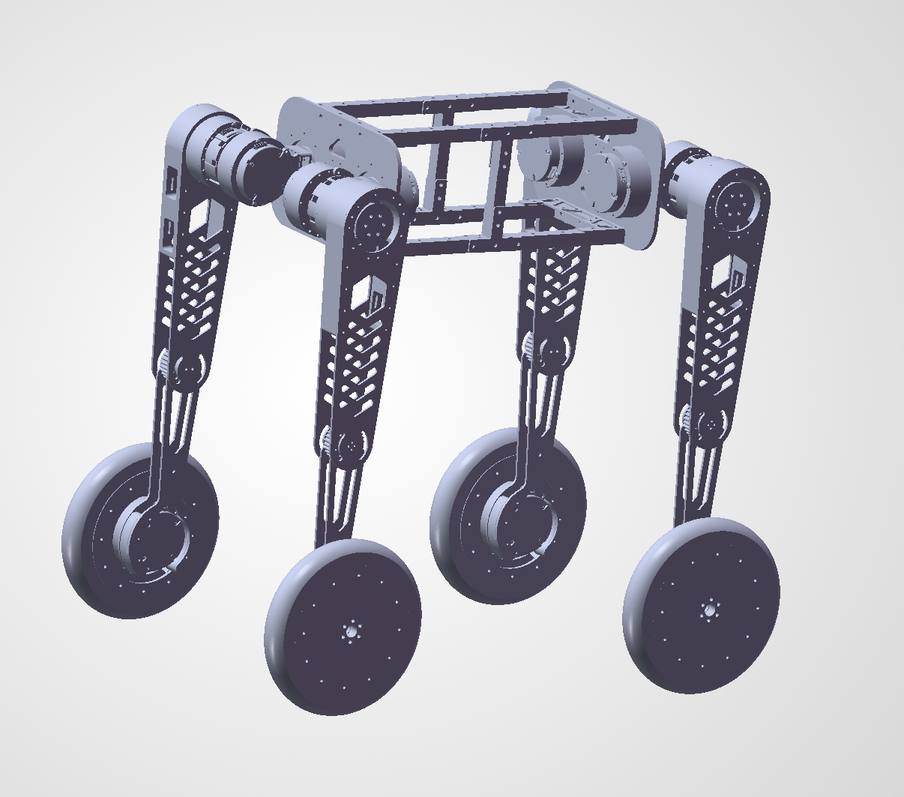

**24V → 19V 降压板 · PCB Layout**

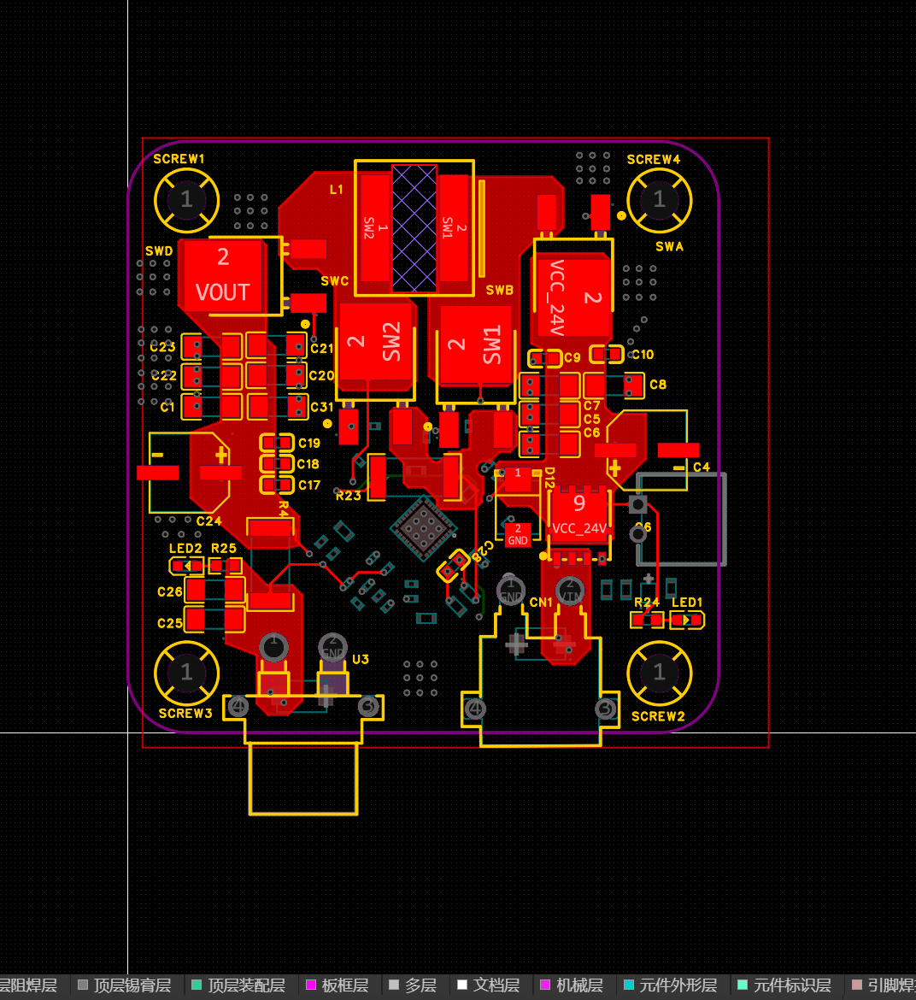

**24V → 19V 降压板 · 3D 预览**

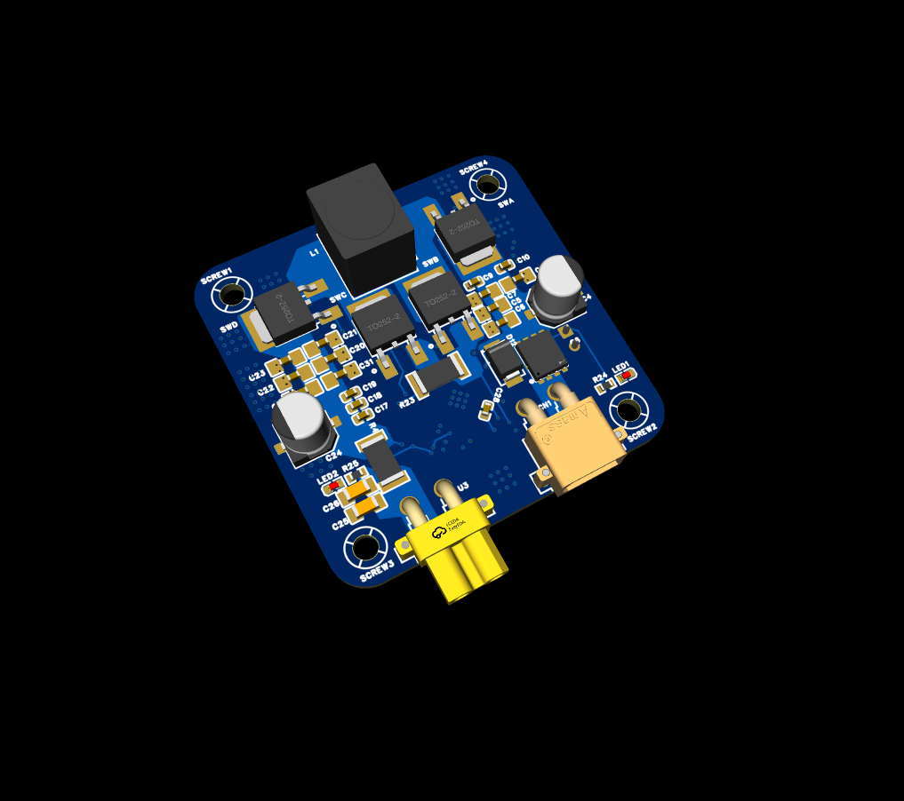

<!-- 【待补素材】四足整机实物照 / 机械结构细节（轮腿关节、传动、轮组、转接件）/ 24V→12V 降压板 / 装机走线照 -->

### 开源工程

- 降压板源工程与 Gerber：[`sources/24v转19v降压/`](./sources/24v转19v降压)
- 整机仓库：[https://github.com/Beni-537/RC_WheelLeg](https://github.com/Beni-537/RC_WheelLeg)

---

## 二、24V 动力分电板（16 路电机）

### 背景与问题

整机 16 个执行器如果各自从电池拉线，会形成大量并联分支与线束，不仅装配困难，且任何一处接触电阻都会在大电流下产生明显压降。需要一块集中的分电板，把**一路 24V 动力输入**可靠地分配到 **16 路输出**。

### 我的职责

独立完成原理图设计、PCB Layout、焊接与上电测试全流程。

### 技术方案

输入为单路 24V 动力电池，通过板载大电流走线分配至 16 路统一端子输出，每路对应一个执行器。设计重点在三处：

- **走线载流**：按总电流与允许温升反推铜箔宽度，主干路径加大铺铜面积，必要时加锡或双面走线；
- **压降控制**：缩短主干路径、增大接触面积，避免末端执行器供电偏低；
- **装配性**：16 路输出采用统一端子，便于快速插拔与排障。

<!-- 待补参数：单路电流 / 总电流 / 铜箔厚度 / 保护方式 / 端子规格 -->

<!-- 【待补素材】分电板正反面实物照 / PCB Layout / 上电与负载测试照 / 参数实测数据 -->

---

## 三、2026 全国大学生电子设计竞赛（TI 杯）· 水管平衡装置

**省级二等奖**

### 背景与问题

在移动车体上，水管内的钢球位置不受控时会持续滑向两端。题目要求通过控制车体运动 / 管体倾角，使钢球稳定在指定位置并具备抗扰能力——这是一个**欠驱动、强耦合的实时闭环系统**：球的位置只能被间接影响，控制必须提前于偏差作出响应。

### 核心产出：MSPM0G3507 拓展板

为竞赛智能小车设计的一款 **TI MSPM0G3507 拓展板**。采用**插接式设计**——MSPM0 核心板直接插在拓展板上即可完成系统搭建，省去大量飞线，可靠性显著提升。

板载资源：

- **TB6612 双路电机驱动**：直接驱动小车双电机，完整引出 `VM / VCC / GND` 与 `AIN1 / AIN2 / BIN1 / BIN2 / PWMA / PWMB / STBY` 控制接口，功率输出为 `OUT1± / OUT2±`；
- **板载电源模块**：12V 输入，降压提供 **5V 与 3.3V** 两路输出，满足主控与多外设供电需求；
- **ICM-42688 六轴陀螺仪**：高精度 IMU，用于车身姿态解算；
- **视觉接口**：预留 4pin UART（`TX / RX / 5V / GND`）对接视觉模块；
- **人机交互**：0.96″ OLED 接口、独立按键、蜂鸣器、拨码开关（3.3V / 5V 电平选择）；
- **扩展排针**：引出核心板全部 IO，便于二次开发与调试。

### 我的职责

负责整车的**机械结构设计**与**硬件电路设计**（M0 拓展板）。

<!-- 待补：调试迭代过程与实测数据（稳定时间、最大偏差等） -->

### 图片

**M0 拓展板 · PCB Layout**

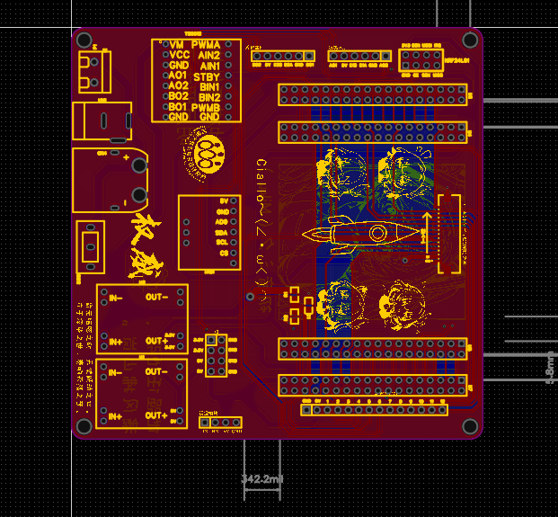

**M0 拓展板 · 实物**

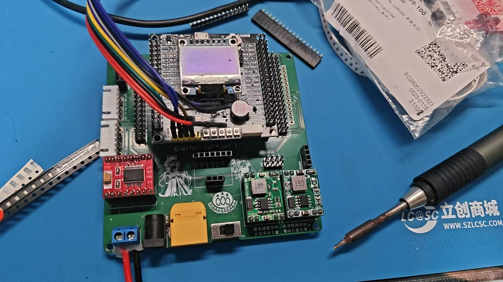

<!-- 【待补素材】整车实物照 / 水管机构特写（钢球 + 检测装置）/ 机械 CAD 截图 / 调试现场照 -->

### 开源工程

- 拓展板源工程与 3D 模型：[`sources/M0拓展板/`](./sources/M0拓展板)

---

## 四、Mini 键盘

### 背景与问题

桌面空间有限，而常用操作（音量调节、复制粘贴、多键组合）反复在键盘上寻找。需要一个可随身携带、按键与旋钮混合输入、且支持完全自定义的迷你输入设备。

### 技术方案

| 项目 | 参数 |
|---|---|
| 按键 | 4 个独立机械轴按键 |
| 旋钮 | 1 个旋转编码器（可按下 + 左右旋转） |
| 输入 | Type-C |
| 功能 | 完全可编程，可映射音量调节 / 组合快捷键 / 滚动等 |

### 图片

**PCB Layout**

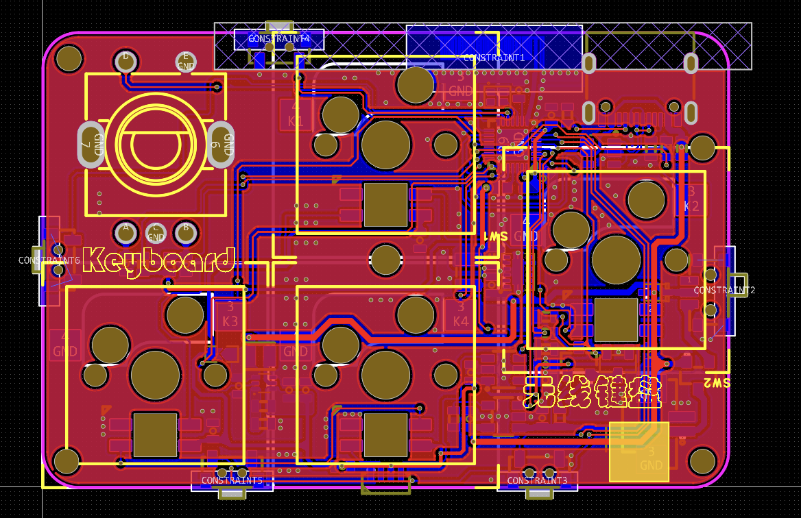

**3D 预览**

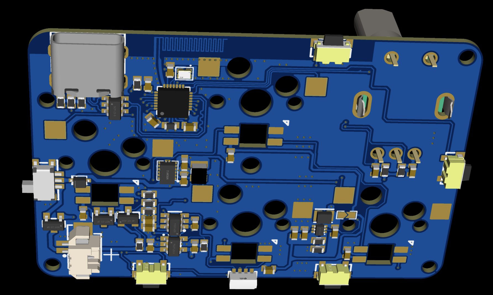

### 开源工程

- 源工程与 3D 模型：[`sources/mini键盘/`](./sources/mini键盘)

---

## 五、小项目合集

### 5.1 STM32 平衡车拓展板

基于 **STM32F103C8T6** 核心板的平衡车专用拓展板，面向自平衡控制学习设计。

- **TB6612 双路电机驱动**：为平衡车提供动力输出；
- **电源管理**：12V 输入，板载降压提供 **5V / 3.3V**；
- **MPU6050 陀螺仪**：车身姿态采集；
- **蓝牙模块**：手机无线遥控 + PID 参数在线整定；
- **扩展接口**：0.96″ OLED、超声波模块、4 路按键、核心板全部 IO 引出。

**PCB Layout**

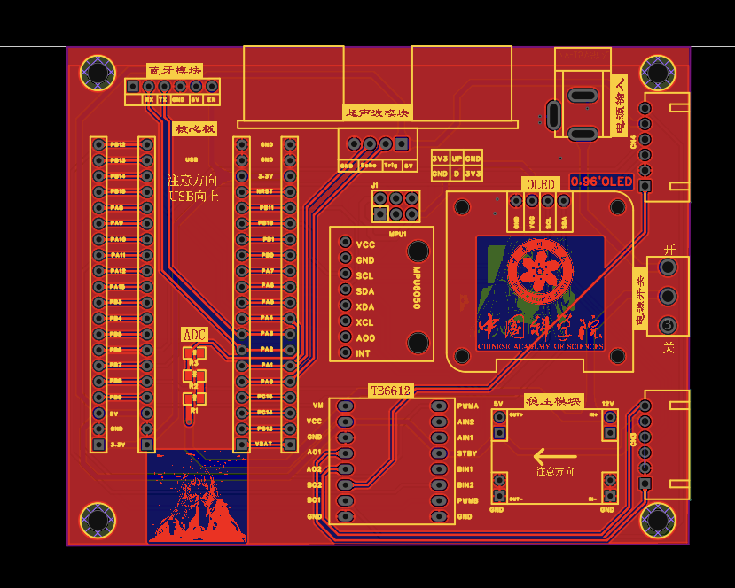

**实物**

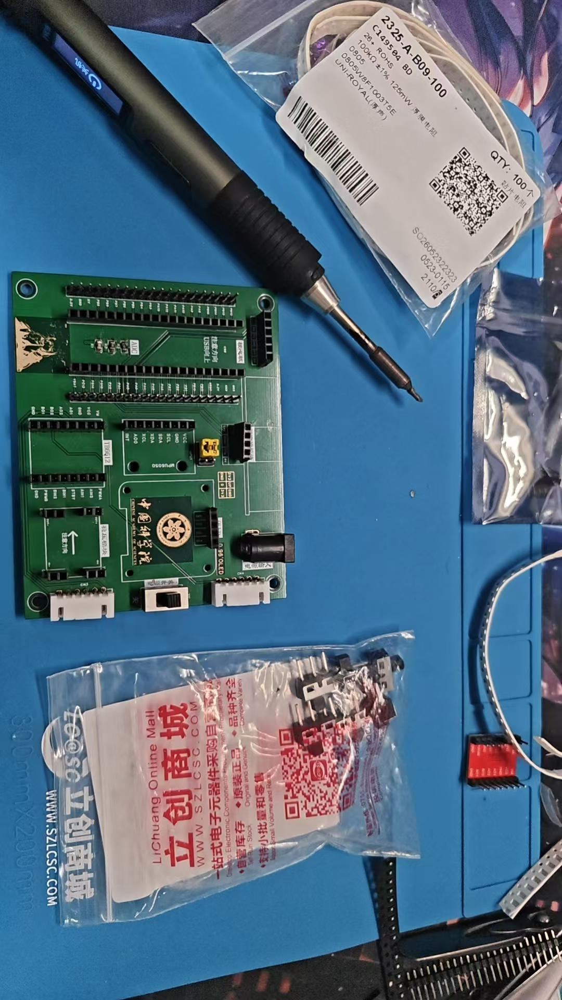

---

### 5.2 高速无线 DAP 调试器 Mini（WDAP-Mini）

基于 **ESP32-S3-MINI-1** 的小型化开源无线调试器：

- 体积仅略大于 2×5P 排针，**可直插开发板**使用；
- 支持 **4–16V 宽压输入**；
- 兼容原版、ABRobot 版等多款调试器配对工作；
- 器件最小封装 0603，**复刻门槛低**，单板复刻成本约 35 元；
- 遵循 GPL 3.0 协议开源。

**3D 预览**

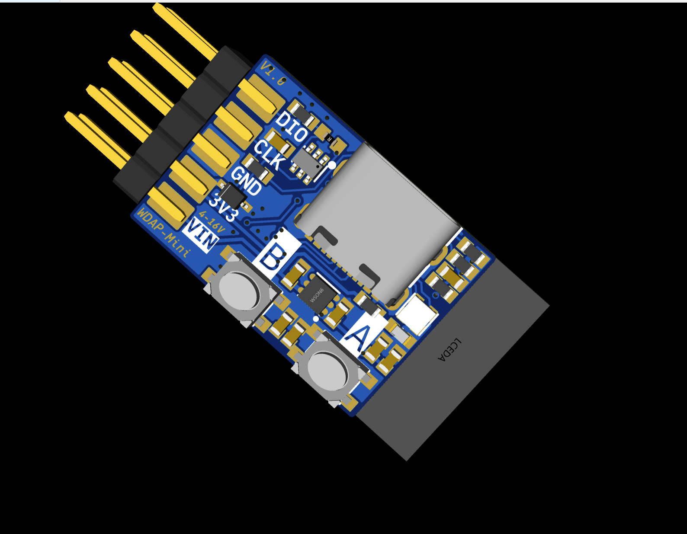

**PCB Layout**

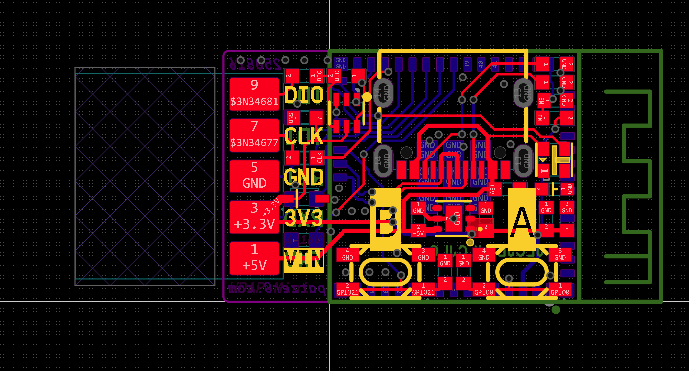

---

### 5.3 USB 2.0 拓展坞

基于标准协议设计的 **USB 2.0 四口拓展坞**，解决笔记本接口不足的问题：

- 单路主机接口 → **4 路标准 USB 2.0 输出**；
- 支持鼠标、键盘、U 盘等多外设并行稳定工作；
- 电路设计注重**信号完整性**与供电安全，保证多设备并发时的稳定性；
- 体积小巧便携，即插即用。

**3D 预览**

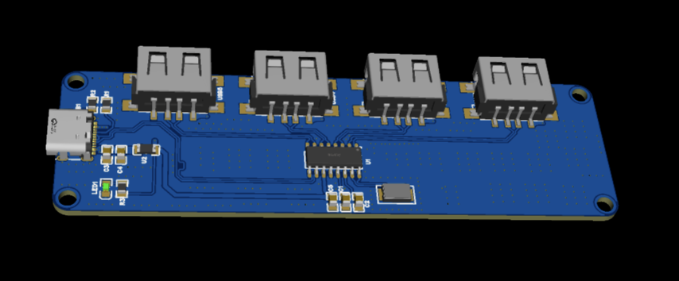

**PCB Layout**

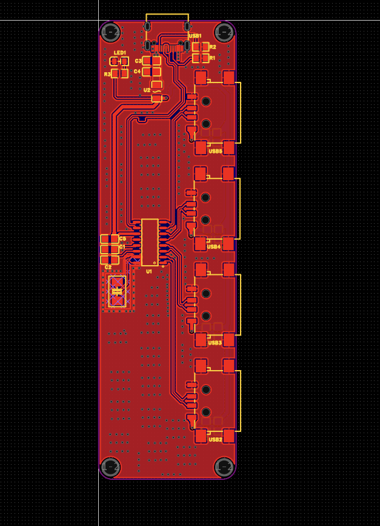

---

## 六、Beats Studio3（录音师3）耳机单元级维修

### 背景与问题

一副 Beats Studio3 无线降噪耳机单侧无声。该机型是蓝牙主板、锂电池、主动降噪麦克风阵列与动圈单元高度集成的结构，原厂不提供单元级维修，需要自行定位到故障级并完成器件替换。

### 我的职责

独立完成 整机拆解 → 故障定位 → 替代单元选型 → 手工焊接装配 → 功能验证 全流程。

### 故障定位

先要区分「单元损坏」与「主板 / 走线损坏」，两者的排查路径完全不同。

- 断开单元与主板的连接，实测故障侧单元两端呈**开路（∞）**，正常侧则可测得稳定阻抗，据此判定为**音圈断路**，排除蓝牙主板功放与连接器问题；
- 对正常侧做同点位对比测量，确认走线、焊点、连接器无异常。

### 单元选型与替换

原厂单元无法单独采购，按四项参数筛选替代单元：**阻抗 / 灵敏度 / 外形尺寸 / 接线极性**。其中阻抗放在第一位——它直接决定同一音量下的声压与阻尼，两侧不一致会出现明显偏音。

焊接工艺：漆包线端部去漆、控温焊接（防止烫伤振膜与音圈引线）、热缩管绝缘、按原极性复原。

### 装配与验证

耳罩复原需保证**腔体密封**——漏气会同时影响低频表现与降噪效果；同时确认 ANC 麦克风与内部走线复位。最后通过左右声道对比试听与音量平衡验证，确认单侧无声故障消除、无明显偏音。

<!-- 【待补素材】拆机过程 / 故障单元特写 / 新旧单元对比 / 焊接特写 / 万用表阻抗读数 / 复原完成 -->

---

## 获奖情况

- ROBOCON 仿生足式障碍赛 **全国一等奖**（2026）
- 全国大学生电子设计竞赛（TI 杯）**省级二等奖**（2026）
- 高校创意 **国家一等奖**（2026）
- RoboCup **国家二等奖**（2025）
- 高校创意 **国家二等奖**
- 算法精英 **国家二等奖**
- RT **国家三等奖**
- 人工智能 **国家三等奖**
- 睿抗四足 **三等奖**

---

## 技能栈

**硬件设计**：原理图设计 · PCB Layout · DC-DC 电源设计 · 大电流分电与线束规划 · 立创EDA

**机电控制**：STM32（F103）· TI MSPM0G3507 · TB6612 电机驱动 · MPU6050 / ICM-42688 姿态传感

**机械设计**：SolidWorks 建模与总装配 · 传动结构设计

**工具与平台**：Git / GitHub · Linux · NVIDIA Jetson Orin Nano · Odin1 激光雷达
